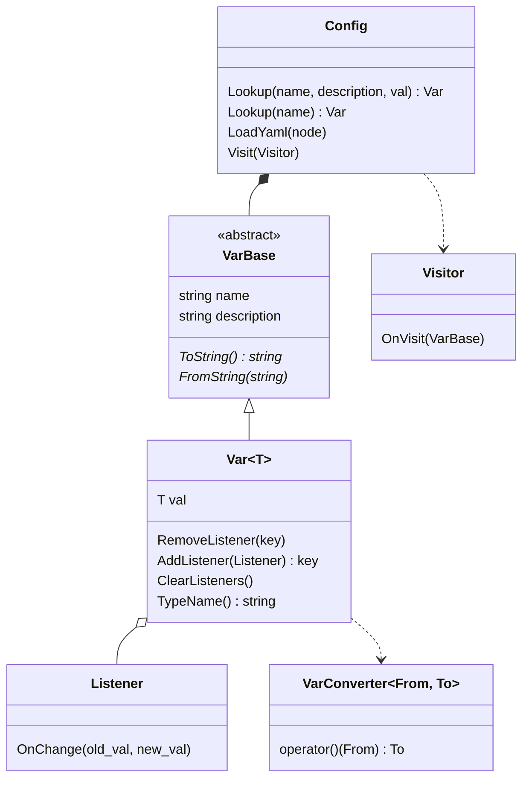
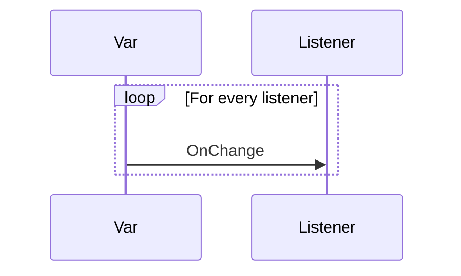
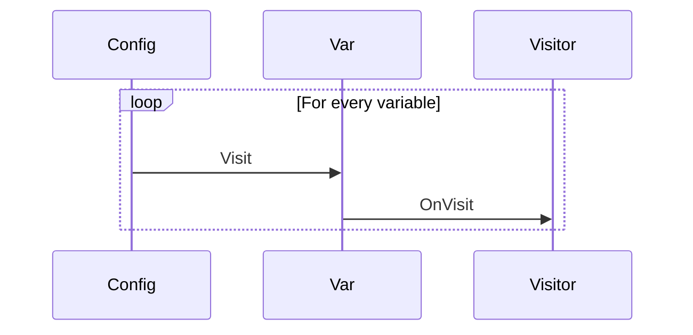

# Configuration

## Overview

```mermaid
classDiagram

class VarBase {
    <<abstract>>
    string name
    string description
    ToString()* string
    FromString(string)*
}

class Var~T~ {
    T val
    RemoveListener(key)
    AddListener(Listener) key
    ClearListeners()
    TypeName() string
}

class Listener {
    OnChange(old_val, new_val)
}

class VarConverter~From, To~ {
    operator()(From) To
}

VarBase <|-- Var

Var o-- Listener
Var ..> VarConverter

class Visitor {
    OnVisit(VarBase)
}

class Config {
    Lookup(name, description, val) Var
    Lookup(name) Var
    LoadYaml(node)
    Visit(Visitor)
}

Config ..> Visitor
Config *-- VarBase
```

## Interactions

### Setting a Variable

```mermaid
sequenceDiagram

participant Var
participant Listener

loop For every listener
Var ->> Listener: OnChange
end
```

### Visiting Variables

```mermaid
sequenceDiagram

participant Config
participant Var

loop For every variable
Config ->> Var: Visit
Var ->> Visitor: OnVisit
end
```