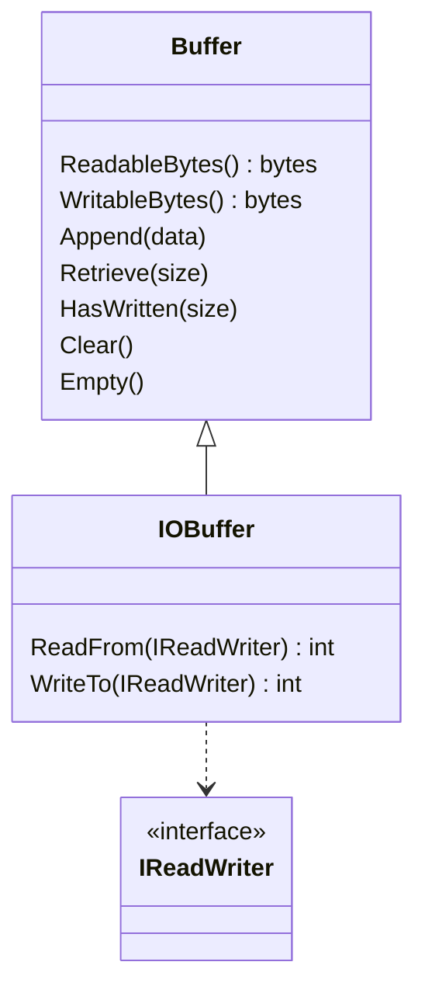
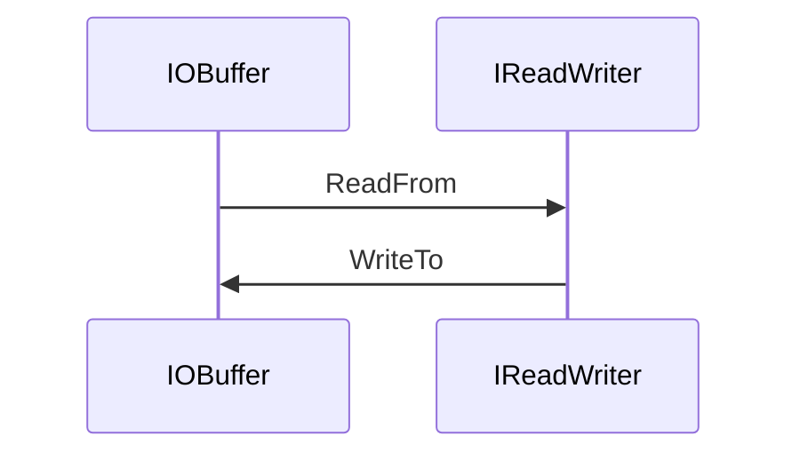
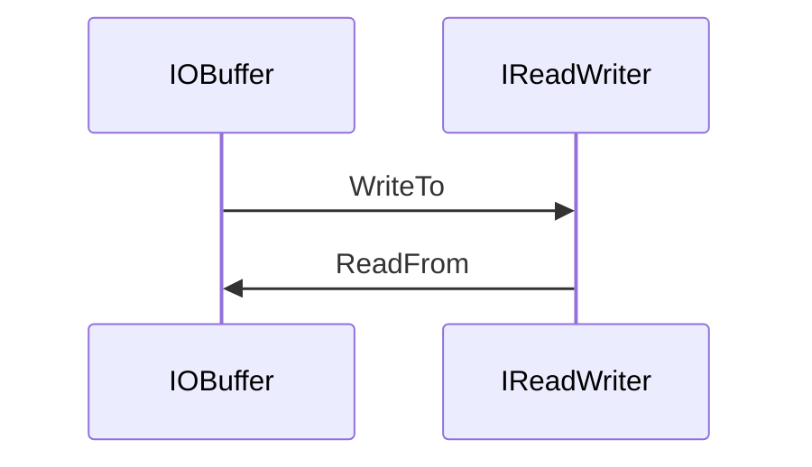

# Buffer

## Overview

```mermaid
classDiagram

class Buffer {
    ReadableBytes() bytes
    WritableBytes() bytes
    Append(data)
    Retrieve(size)
    HasWritten(size)
    Clear()
    Empty()
}

class IReadWriter {
    <<interface>>
}

class IOBuffer {
    ReadFrom(IReadWriter) int
    WriteTo(IReadWriter) int
}

Buffer <|-- IOBuffer
IOBuffer ..> IReadWriter
```

## Interactions

### I/O Reading

```mermaid
sequenceDiagram

participant IOBuffer
participant IReadWriter

IOBuffer ->> IReadWriter: ReadFrom
IReadWriter ->> IOBuffer: WriteTo
```

### I/O Writing

```mermaid
sequenceDiagram

participant IOBuffer
participant IReadWriter

IOBuffer ->> IReadWriter: WriteTo
IReadWriter ->> IOBuffer: ReadFrom
```