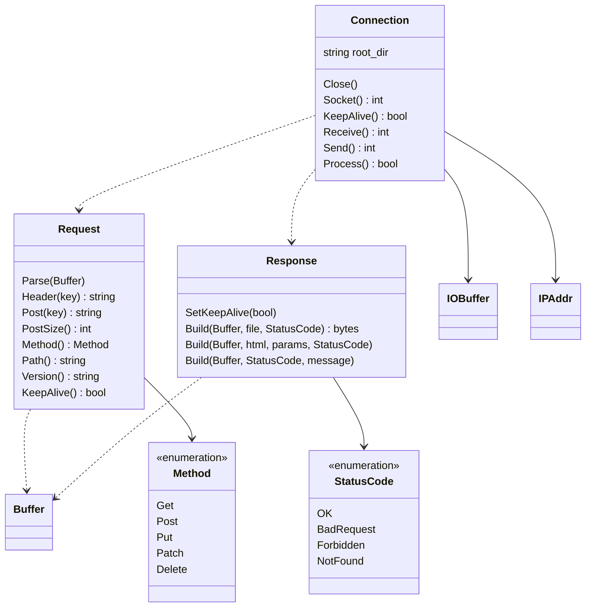
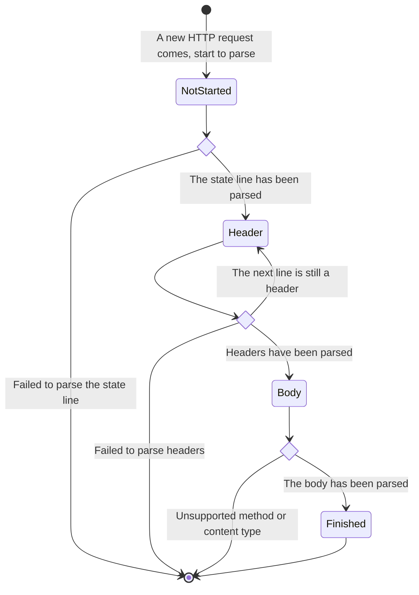
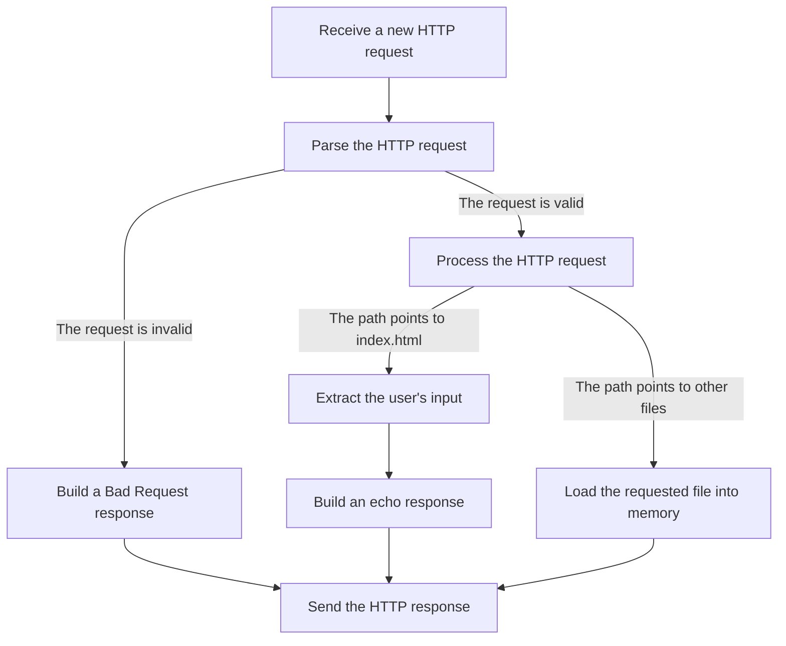

# HTTP

## Overview

```mermaid
classDiagram

class StatusCode {
    <<enumeration>>
    OK
    BadRequest
    Forbidden
    NotFound
}

class Method {
    <<enumeration>>
    Get
    Post
    Put
    Patch
    Delete
}

class Request {
    Parse(Buffer)
    Header(key) string
    Post(key) string
    PostSize() int
    Method() Method
    Path() string
    Version() string
    KeepAlive() bool
}

Request ..> Buffer
Request --> Method

class Response {
    SetKeepAlive(bool)
    Build(Buffer, file, StatusCode) bytes
    Build(Buffer, html, params, StatusCode)
    Build(Buffer, StatusCode, message)
}

Response ..> Buffer
Response --> StatusCode

class Connection {
    string root_dir

    Close()
    Socket() int
    KeepAlive() bool
    Receive() int
    Send() int
    Process() bool
}

Connection --> IOBuffer
Connection --> IPAddr

Connection ..> Request
Connection ..> Response
```

## State Transitions

### Request Parsing

```mermaid
stateDiagram-v2

[*] --> NotStarted: A new HTTP request comes, start to parse

state if_to_header <<choice>>
NotStarted --> if_to_header
if_to_header --> Header: The state line has been parsed
if_to_header --> [*]: Failed to parse the state line

state if_to_body <<choice>>
Header --> if_to_body
if_to_body --> Header: The next line is still a header
if_to_body --> Body: Headers have been parsed
if_to_body --> [*]: Failed to parse headers

state if_to_finished <<choice>>
Body --> if_to_finished
if_to_finished --> Finished: The body has been parsed
if_to_finished --> [*]: Unsupported method or content type

Finished --> [*]
```

## Flows

### Request Processing

```mermaid
flowchart TB

receive[Receive a new HTTP request] --> parse[Parse the HTTP request]

parse -- The request is invalid --> bad-request[Build a Bad Request response]
bad-request --> send[Send the HTTP response]

parse -- The request is valid --> process[Process the HTTP request]

process -- The path points to index.html --> extract-params[Extract the user's input]
extract-params --> echo[Build an echo response]
echo --> send

process -- The path points to other files --> load-file[Load the requested file into memory]
load-file --> send
```