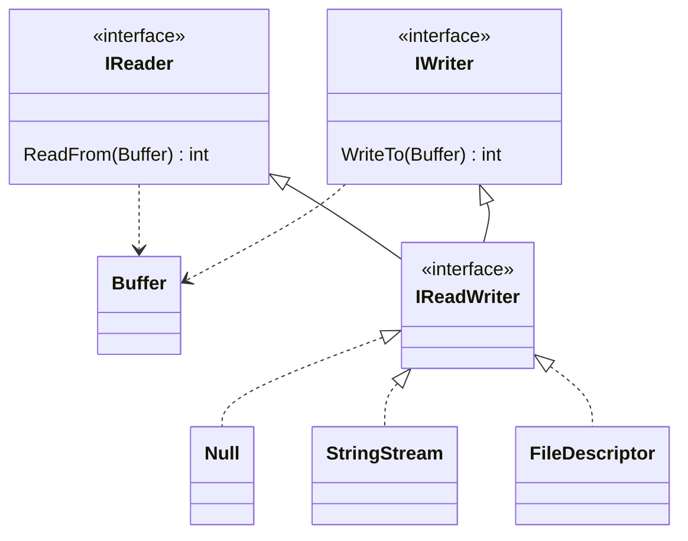

# I/O

## Overview

```mermaid
classDiagram

class IReader {
    <<interface>>
    ReadFrom(Buffer) int
}

IReader ..> Buffer

class IWriter {
    <<interface>>
    WriteTo(Buffer) int
}

IWriter ..> Buffer

class IReadWriter {
    <<interface>>
}

IReader <|-- IReadWriter
IWriter <|-- IReadWriter

class Null
IReadWriter <|.. Null

class StringStream
IReadWriter <|.. StringStream

class FileDescriptor
IReadWriter <|.. FileDescriptor
```