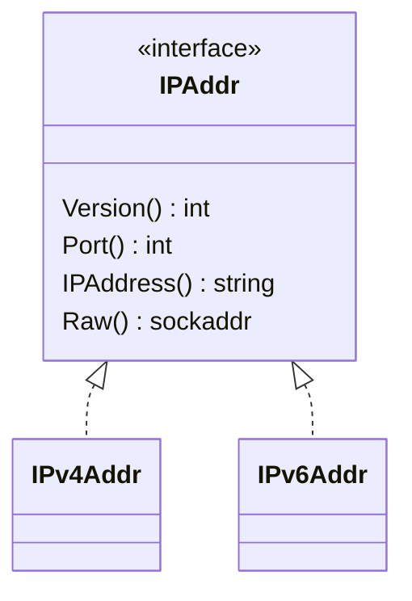

# IP Address

## Overview

```mermaid
classDiagram

class IPAddr {
    <<interface>>
    Version() int
    Port() int
    IPAddress() string
    Raw() sockaddr
}

class IPv4Addr
IPAddr <|.. IPv4Addr

class IPv6Addr
IPAddr <|.. IPv6Addr
```