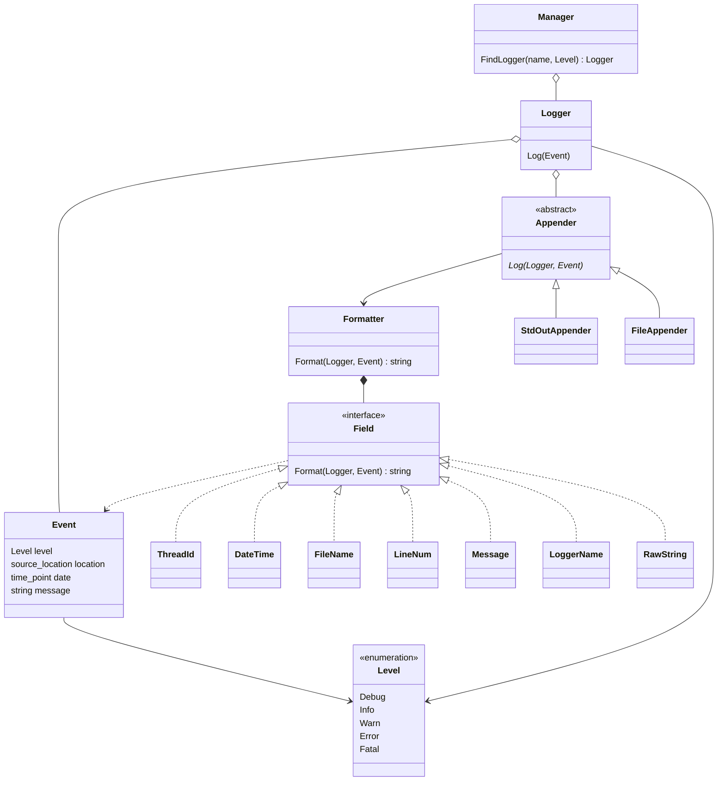
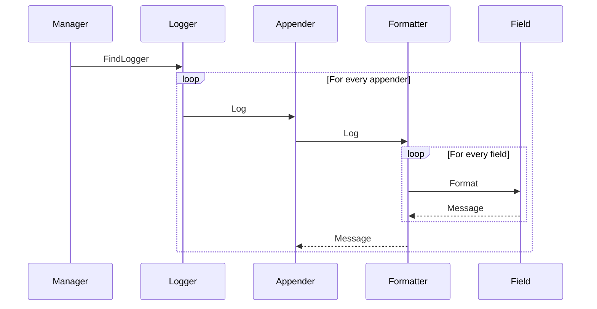

# Logger

## Overview



## Interactions

### Event Logging



## Configuration

The logger configuration can be defined using `YAML`. Here is a sample.

```yaml
# The root tag.
loggers:
  # A logger's name.
  - name: root
    # The current logger's level which can be "debug", "info", "warn", "error" or "fatal".
    level: info
    # The current logger's event capacity.
    # If it is zero, the logger will be synchronous, otherwise asynchronous.
    capacity: 50
    # The current logger's appenders.
    appenders:
      # This logger has two appender.
      # A appender's type which can be "stdout" or "file".
      - type: stdout
      - type: file
        # A file appender needs a file name.
        file: log.txt
  - name: system
    level: debug
    # A custom format.
    formatter: "%d%T%m%n"
    appenders:
      # This logger has one appender.
      - type: stdout
```

The logger supports two kinds of appenders:

- The *Standard Output Appender*

  It writes events to the standard output stream.

  ```yaml
  appenders:
    - type: stdout
  ```

- The *File Appender*

  It writes events to a local file.

  ```yaml
  appenders:
    - type: file
      file: log.txt
  ```